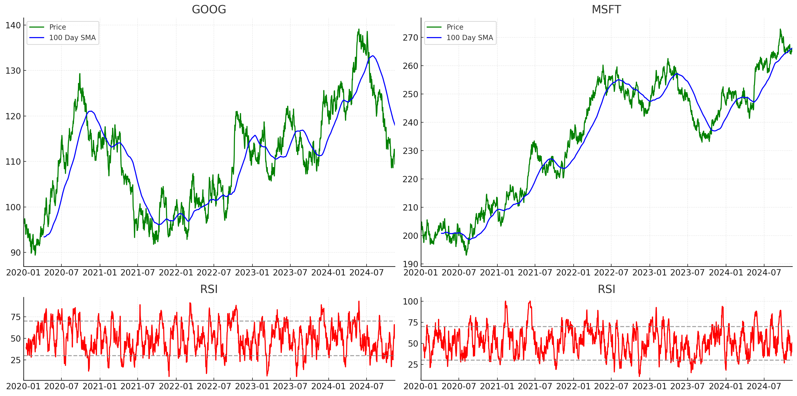
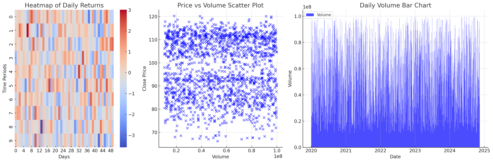
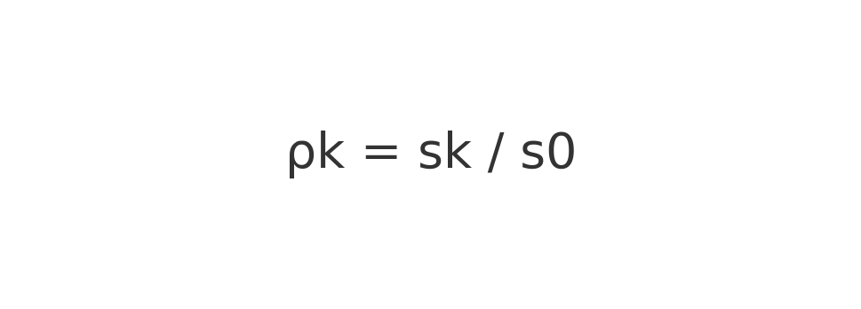
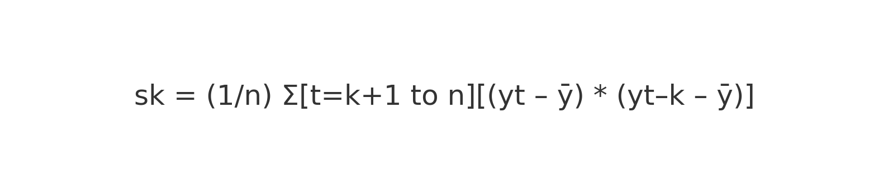

# Stock-Market-Data-Visualization

# Stock Market Data Visualization Using Python

## Project Overview
Stock markets are renowned for their dynamic nature, making it challenging to accurately predict fluctuations owing to myriad influencing factors. However, recent strides in machine learning and computing have empowered us to process vast datasets efficiently. This enables the analysis of historical stock exchange data to discern trends and forecast future changes.

In this project, we'll harness the power of Python to analyze stock data spanning the past 13 years, focusing on the NIFTY-50 stock market dataset available on Kaggle (2008–2021). Despite the dataset containing multiple files and stocks, we'll streamline our focus by selecting a single file for visualization in this project.

By leveraging Python's robust libraries and tools, we aim to gain insights into the trends and patterns within the selected stock data, thereby contributing to a deeper understanding of stock market dynamics and potential predictive capabilities

---

## Key Libraries Used
- **Matplotlib**: Basic visualization library.
- **Pandas**: For data manipulation and preprocessing.
- **NumPy**: Numerical operations and computations.
- **Plotly Express**: Interactive visualizations.
- **Seaborn**: Advanced visualization and statistical insights.

---

## Data Description
The dataset consists of daily stock prices and trading volumes for multiple stocks. Key columns include:

- **High**: The highest price of the stock for the day.
- **Low**: The lowest price of the stock for the day.
- **VWAP (Volume-Weighted Average Price)**: A benchmark that reflects the average price weighted by trading volume. 

### VWAP Formula:

---

## Data Preprocessing
1. **Set the Date as Index**: The "Date" column is transformed into the index for easier time-series analysis.
2. **Filter the Time Frame**: Focus is on data between May 26, 2008, and April 30, 2021.
3. **Convert Index to Column**: Reverting the index to a regular column for specific computations.

---

## Data Visualization
The project uses **Seaborn** and **Plotly Express** to generate insights into stock data:

1. **Daily Volume and Highest Price**: Plot the daily trading volume and highest price.
2. **Simple Moving Average (SMA)**:
   - Smooths out short-term price fluctuations.
   - Provides trends and potential buy/sell signals.

### SMA Formula:

Example: A 10-day SMA is calculated by averaging the closing prices of the last 10 days. As new data is added, the oldest data point is dropped.

3. **Autocorrelation Analysis**:
   - Measures correlation between a time series and its lagged values.
   - Autocorrelation Function (ACF) Formula:
     
     - \( sk \): Sample autocovariance at lag \( k \).
     - \( s0 \): Sample variance.

4. **Heat Maps**:
   - Visualize price intensity across different time frames using color-coded cells.

---

## Autocorrelation Analysis
Autocorrelation identifies patterns in time series data, such as seasonality and periodicity. This informs the selection of forecasting models like ARIMA.

### Autocorrelation Formula:

- \( yt \): Value at time \( t \).
- \( y \): Mean of the time series.
- \( k \): Lagged period.

---

## Heat Maps
Heat maps display the intensity of variables (e.g., stock price) over different time frames using a gradient of colors. This helps identify patterns such as spikes or dips in prices over specific intervals.

---

## Dataset Link
[NIFTY-50 Stock Market Data](https://www.kaggle.com/datasets/rohanrao/nifty50-stock-market-data?select=BAJAJFINSV.csv)
